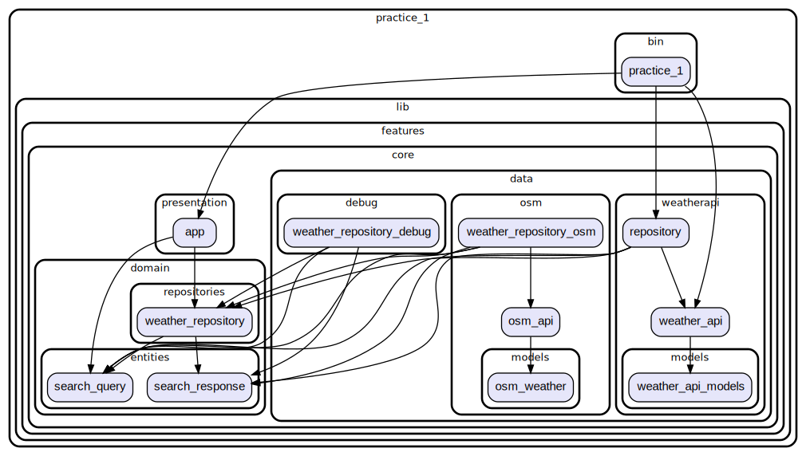

# HW 1

## Выполнил Каневский Даниил БПМ-22-ПО-1

## П.1
### WeatherAPI
Ссылка на API: https://www.weatherapi.com/

## П.2 
Обе реализации репозитория поддерживают получения текущей погоды как по городу, так и по координатам.

* [WeatherAPI](lib/features/core/data/weatherapi)
* [OSMApi](lib/features/core/data/osm)

## П.3

